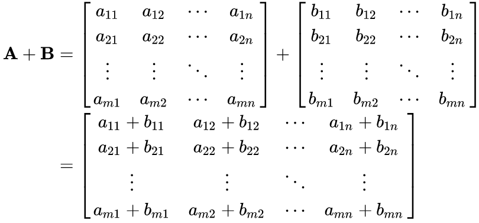

CUDA: Matrix Sum
================================================================================

The objective of this assignment is to parallelize a matrix sum operation in the
GPU. A matrix sum can be performed by adding matrices `A` and `B` element-wise
and storing the result in the corresponding position in matrix `C`. A serial
implementation that runs on the CPU is given for reference.



### Input

The program takes two numbers as input: the number of rows and columns of the
matrices `A`, `B`, and `C`.

### Output

The program outputs the sum of all elements in matrix `C`.

<hr />

**Hint:** Consider using a 2-dimensional configuration of blocks and threads.

**Hint:** Do not forget that data must be allocated and moved explicitly between
the host and the device.

Tasks & Rules
--------------------------------------------------------------------------------

You should do the following tasks:

- [ ] Understand the serial code in `src/matsum-serial.c`
- [ ] Parallelize the code using CUDA in the file `src/matsum-parallel.cu`
- [ ] Run both versions and compare them. Did you get any speedup?

You must **not** change the serial implementation, only the parallel one.

Grading
--------------------------------------------------------------------------------

Your assignment will be evaluated in terms of:

- Correctness: your program returns the correct result;
- Performance: your program runs faster than the serial implementation.

In order to test your solution, you can use one of the inputs available inside
the `tests/` directory. Whenever you push your changes to GitHub, the Continuous
Integration (CI) system will compile, run and execute your program using those
tests. Your grade will **not** be computed from the CI runs because other
processes may be running in the server, thus interfering with runtime and
speedup.

Your grade will be computed using an automated routine restricted to the
instructors and TAs. This routine will be run after the assignment deadline,
using the latest commit push to the branch `master` before the deadline. Your
code will be ensured to run in an environment with no competition for resources.

**Note:** Both the CI and automatic grading routine expect your the output of
your program to be formatted correctly. For that reason, you should not add
`printf`s or any other function that writes to `stdout`, otherwise your
assignment will be considered incorrect.

**Note:** Tampering with the serial implementation or the tests is considered
cheating and will result in disqualification of the assignment.

Compiling & Running
--------------------------------------------------------------------------------

After you have accepted this assignment on the course's GitHub Classroom page,
clone it to your machine. First you have to generate the build system using
[CMake](https://cmake.org/). Make sure you have it installed!  If you are
working locally, you will also need an OpenMP compatible compiler and the CUDA
framework installed compiler.

Then, run the following commands:

```bash
# Where the build will live
mkdir build && cd build

# Generate the Makefiles
cmake -DCMAKE_BUILD_TYPE=Release ..
```

Having done that, still inside the `build` directory, run `make` to compile
everything. Finally, from the root directory of the repo you can execute the
serial and parallel versions like so:

```bash
build/serial tests/1.in
build/parallel tests/2.in
```

If you have any doubts or run into problems, please contact the TAs. Happy
coding! :smile: :keyboard:
 
Running on the Kahuna cluster
--------------------------------------------------------------------------------

If your computer does not have a NVIDIA GPU, you can test your code on the Kahuna cluster using the job file in this repository: *kahuna_job.pbs*. You **must** use the cluster's **queue system** to guarantee fair resource allocation. To see instructions on how to connect to the cluster and submit your job for execution, see this [**tutorial**](https://github.com/mo644-mc970-2s2020/kahuna-tutorial).

Contribute
--------------------------------------------------------------------------------

Found a typo? Something is missing or broken? Have ideas for improvement? The
instructor and the TAs would love to hear from you!

About
--------------------------------------------------------------------------------

This repository is one of the assignments handed out to the students in course
"MO644/MC970 - Introduction to Parallel Programming" offered by the Institute of
Computing at Unicamp.
