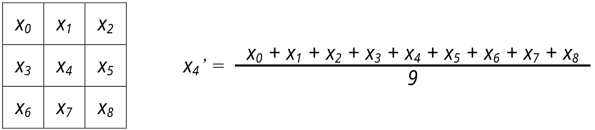
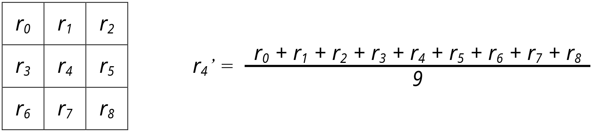
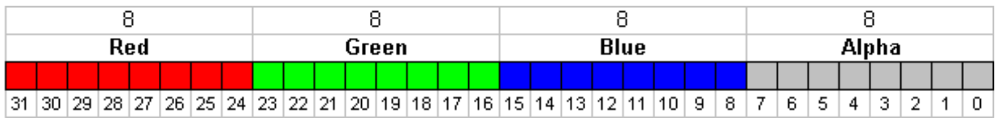

CUDA: Smoothing
================================================================================

In this assignment you should apply a smoothing stencil filter to an image using
CUDA. The main use-case of the smoothing filter is to eliminate a
non-representative pixel from the image in relation to its neighboring pixels
or, in other words, to remove noise from the image.

The simplest form of a smoothing filter is the algorithm that considers a `3x3`
subsets of the image, where the center pixel (`x_4`) is assigned the average of
the pixels in the `3x3` window. Observe the following figure for an example.



However, the previous example assumes that the image is represented in gray
scale. Most commonly, we deal with colored images where each pixel has three
color channels: red, green, and blue. Therefore, the same computation must be
executed for each channel separately. In the following figure, for example, the
computation is applied to the red channel of the image.



The stencil may not not be limited to `3x3` masks and can also use `5x5`, `7x7`,
`9x9`, etc. This behavior is controlled by the `MASK_WIDTH` macro in the code.
When computing pixels on the border of the image, the mask will go
out-of-bounds. For example, from the Figure above, imagine `r_4` is on the left
edge of the image. In this case, `r_0`, `r_3`, and `r_6` will have no
corresponding pixel and should be considered zero. This out-of-bounds region is
called the *padding*.

The image is represented in the [PPM file format][netpbm]. PPM is a
simple format without compression which stores a header followed by the pixels
from left to right, top to bottom. Each pixels has four channels: red, green,
and blue. Each channel has 8 bits, therefore each pixel is 3 bytes large. The
following image exemplifies the data layout, except the alpha channel is not
present in our images.



### Input

This program reads the path to the image from the input file.

### Output

The program outputs the smoothed image in `stdout`. To save the image to a file
redirect this program output in the command-line as such:

```console
# Save image to file `output-image.ppm`
parallel tests/1.in > output-image.ppm
```

[netpbm]: https://en.wikipedia.org/wiki/Netpbm

Tasks & Rules
--------------------------------------------------------------------------------

You should do the following tasks:

- [ ] Understand the serial code in `src/smooth-serial.c`
- [ ] Parallelize the code using CUDA in the file `src/smooth-parallel.c`
- [ ] Run both versions and compare them. Did you get any speedup?
- [ ] Experiment with different `MASK_WIDTH` sizes. What is the visual effect on
  the resulting image?
- [ ] Experiment with different number of blocks and threads. What is the
  fastest configuration you found?

You must **not** change the serial implementation, only the parallel one.

Grading
--------------------------------------------------------------------------------

Your assignment will be evaluated in terms of:

- Correctness: your program returns the correct result;
- Performance: your program runs faster than the serial implementation.

In order to test your solution, you can use one of the inputs available inside
the `tests/` directory. Whenever you push your changes to GitHub, the Continuous
Integration (CI) system will compile, run and execute your program using those
tests. Your grade will **not** be computed from the CI runs because other
processes may be running in the server, thus interfering with runtime and
speedup.

Your grade will be computed using an automated routine restricted to the
instructors and TAs. This routine will be run after the assignment deadline,
using the latest commit push to the branch `master` before the deadline. Your
code will be ensured to run in an environment with no competition for resources.

**Note:** Both the CI and automatic grading routine expect your the output of
your program to be formatted correctly. For that reason, you should not add
`printf`s or any other function that writes to `stdout`, otherwise your
assignment will be considered incorrect.

**Note:** Tampering with the serial implementation or the tests is considered
cheating and will result in disqualification of the assignment.

Compiling & Running
--------------------------------------------------------------------------------

After you have accepted this assignment on the course's GitHub Classroom page,
clone it to your machine. First you have to generate the build system using
[CMake](https://cmake.org/). Make sure you have it installed!  If you are
working locally, you will also need an OpenMP compatible compiler and the CUDA
framework installed compiler.

Then, run the following commands:

```bash
# Where the build will live
mkdir build && cd build

# Generate the Makefiles
cmake -DCMAKE_BUILD_TYPE=Release ..
```

Having done that, still inside the `build` directory, run `make` to compile
everything. Finally, from the root directory of the repo you can execute the
serial and parallel versions like so:

```bash
build/serial tests/1.in >out.ppm
build/parallel tests/2.in >out.ppm
```

The file `out.ppm` is the output image. If you have any doubts or run into
problems, please contact the TAs. Happy coding! :smile: :keyboard:

Contribute
--------------------------------------------------------------------------------

Found a typo? Something is missing or broken? Have ideas for improvement? The
instructor and the TAs would love to hear from you!

About
--------------------------------------------------------------------------------

This repository is one of the assignments handed out to the students in course
"MO644/MC970 - Introduction to Parallel Programming" offered by the Institute of
Computing at Unicamp.
