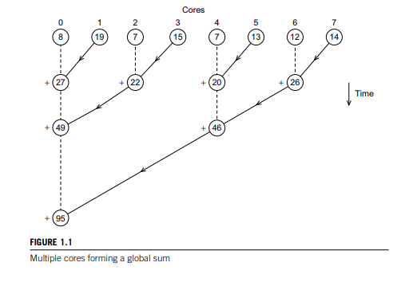

OpenMP Tasks: Tree Reduction
================================================================================

In this lab you are supposed to implement a reduction operation using OpenMP
Tasks. As we have studied before, OpenMP `parallel for` directive already has a
`reduce` clause, so why should we implement it ourselves? As it turns out, we
might need different reduction operators than those that are described in the
OpenMP standard. For example, it is possible to reduce by multiplying scalars in
OpenMP, but it is not possible to reduce by multiplying matrices. Your goal is
to implement the latter!

The program generates `N` matrices `A_1, A_2, ..., A_n` of size `m` by `m` and
compute their product `A = A_1 * A_2 * ... * A_n`. Your goal is to parallelize
this code by performing a tree reduction, as exemplified by the following image:



Notice that in the first iteration, matrices 0 and 1 are multiplied together and
accumulated in 0. Same goes for 2 and 3 (accumulated in 2), and so on. Then, on
the next step, matrices 0 and 2 are multiplied and accumulated in 0, same for 4
and 6, etc. This process is repeated until the final multiplication is available
in position 0. This algorithm is appropriately called "Tree Reduction". Observe
that, the branches on the same level of the tree are independent of each other
and can thus be executed in different threads (or in this case, tasks).

### Input

This program takes two numbers as input:

- The number of matrices to be multiplied `N`;
- The size of the square matrices `m`.

Example:

```
2 3
```

### Output

The output of this program is the final matrix, one line at a time.

Tasks & Rules
--------------------------------------------------------------------------------

You should do the following tasks:

- [ ] Understand the serial code in `src/matmul-serial.c`
- [ ] Parallelize the code using OpenMP Tasks in the file `src/matmul-parallel.c`
- [ ] Run both versions and compare them. Did you get any speedup?

You must **not** change the serial implementation, only the parallel one.

Grading
--------------------------------------------------------------------------------

Your assignment will be evaluated in terms of:

- Correctness: your program returns the correct result;
- Performance: your program runs faster than the serial implementation.

In order to test your solution, you can use one of the inputs available inside
the `tests/` directory. Whenever you push your changes to GitHub, the Continuous
Integration (CI) system will compile, run and execute your program using those
tests. Your grade will **not** be computed from the CI runs because other
processes may be running in the server, thus interfering with runtime and
speedup.

Your grade will be computed using an automated routine restricted to the
instructors and TAs. This routine will be run after the assignment deadline,
using the latest commit push to the branch `master` before the deadline. Your
code will be ensured to run in an environment with no competition for resources.

**Note:** Both the CI and automatic grading routine expect your the output of
your program to be formatted correctly. For that reason, you should not add
`printf`s or any other function that writes to `stdout`, otherwise your
assignment will be considered incorrect.

**Note:** Tampering with the serial implementation or the tests is considered
cheating and will result in disqualification of the assignment.

Compiling & Running
--------------------------------------------------------------------------------

After you have accepted this assignment on the course's GitHub Classroom page,
clone it to your machine. First you have to generate the build system using
[CMake](https://cmake.org/). Make sure you have it installed! You will also need
an OpenMP compatible compiler. If you use Linux, you are good to go. For MacOS
users, you can install the OpenMP libraries via [Homebrew](https://brew.sh/)
with the following command:

```bash
# Only for MacOS users
brew install libomp
```

Then, run the following commands:

```bash
# Where the build will live
mkdir build && cd build

# Generate the Makefiles
cmake -DCMAKE_BUILD_TYPE=Release ..
```

Having done that, still inside the `build` directory, run `make` to compile
everything. Finally, from the root directory of the repo you can execute the
serial and parallel versions like so:

```bash
build/serial tests/1.in
build/parallel tests/2.in
```

If you have any doubts or run into problems, please contact the TAs. Happy
coding! :smile: :keyboard:

Contribute
--------------------------------------------------------------------------------

Found a typo? Something is missing or broken? Have ideas for improvement? The
instructor and the TAs would love to hear from you!

About
--------------------------------------------------------------------------------

This repository is one of the assignments handed out to the students in course
"MO644/MC970 - Introduction to Parallel Programming" offered by the Institute of
Computing at Unicamp.

This assignment was originally created by Lucas Silva
@[m4rquee](https://github.com/m4rquee).
